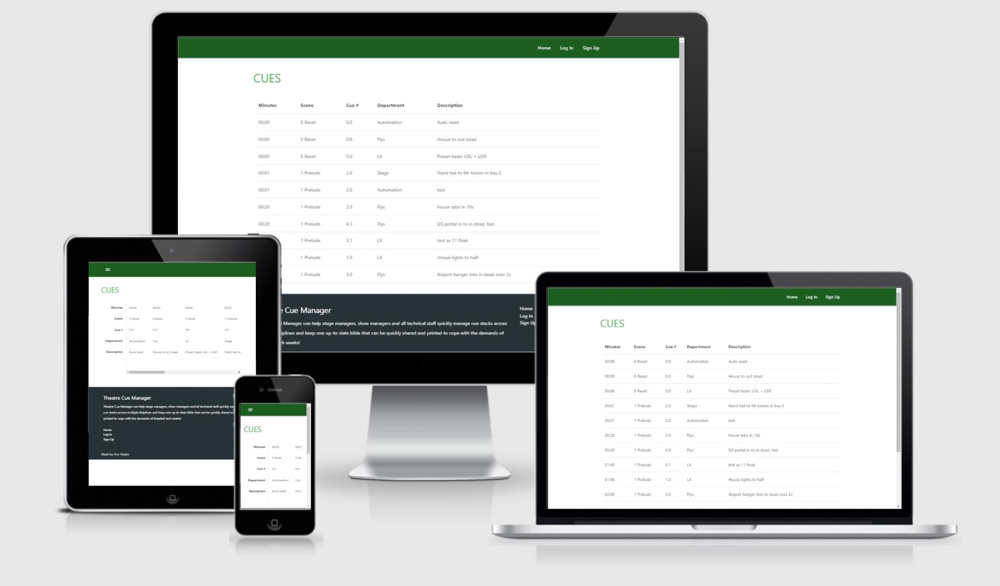
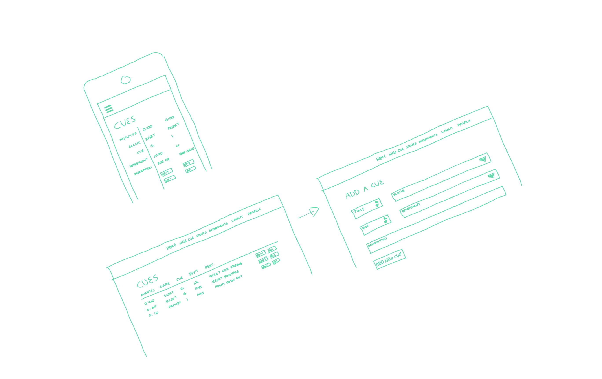
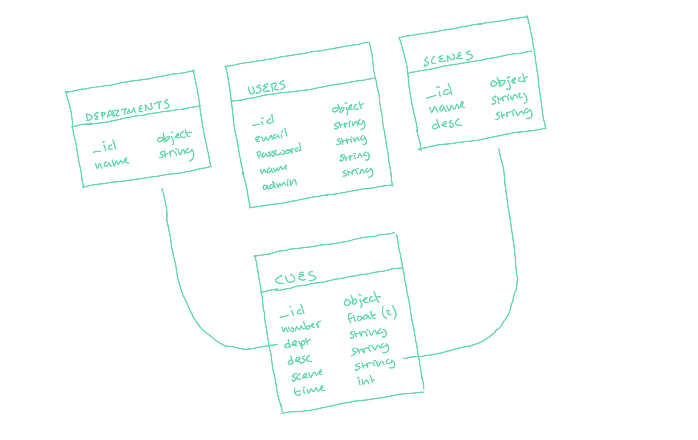

# Theatre Cue Manager
## By Tom Naylor

**View live site:** http://cue-manager-tn-ci-ms3.herokuapp.com/

**View GitHub repo:** https://github.com/tomnaylor/codeinstitute-ms3

Welcome to the theatre cue manager. The web application aims to make managing a theatre production cue stack as easy as possible and gives users the ability to add and edit cues, manager departments and scenes and print out cue sheets for individual departments

## Table of contents
* [UX](#ux)
  * [Target Audience](#target-audience)
  * [User Stories](#user-stories)
    * [First time visitor](#first-time-visitor)
    * [Returning visitor](#returning-visitor)
  * [Site Owners Goals](#site-owners-goals)
  * [Design](#design)
    * [Wireframes](#wireframes)
    * [Database](#database)
    * [Fonts](#font-family)
    * [Colours](#colours)
* [Features](#features)
  * [Existing Features](#existing-features)
    * [Navigation](#navigation)
    * [Help and how to use section](#help-and-how-to-use-section)
    * [Current season prediction](#current-season-prediction)
    * [Previous seasons](#previous-seasons)
    * [Race standings](#race-standings)
    * [Head to head](#head-to-head)
    * [Circuit info](#circuit-info)
  * [Features left to implement](#features-left-to-implement)
    * [Using cache for the API data](#using-cache-for-the-api-data)
    * [More prediction inputs](#more-prediction-inputs)
    * [Prediction techniques](#prediction-techniques)
    * [Fastest lap](#fastest-lap)
    * [Add more seasons](#add-more-seasons)
    * [WIKI API](#wiki-api)
* [Technologies used](#technologies-used)
  * [Languages](#languages)
  * [Libraries and APIs](#libraries-and-apis)
  * [Tools](#tools)
* [Testing](#testing)
  * [Automatic testers / validators](#automatic-testers-and-validators)
    * [W3C HTML validator](#w3c-html-validator)
    * [Jigsaw CSS Validator](#jigsaw-css-validator)
    * [JS HINT](#js-hint)
    * [Lighthouse](#lighthouse)
  * [Testing against the user Stories](#testing-against-the-user-stories)
    * [First time visitor](#first-time-visitor)
    * [Returning visitor](#returning-visitor)
  * [Manual Testing](#manual-testing)
    * [Navigation menu](#navigation-menu)
    * [Current user testimonials](#current-user-testimonials)
    * [Sign up and contact forms](#sign-up-and-contact-forms)
  * [Known Bugs](#known-bugs)
    * [Resolved](#resolved)
    * [Un-Resolved](#un-Resolved)
* [Deployment](#deployment)
* [Credits](#credits)
  * [Content](#content)
  * [Acknowledgements](#acknowledgements)

## UX

### Target Audience
* Theatre staage managers
* Theatre production managers
* Venue technicians

### User Stories
#### First time visitor
As a first time user:
* I want to see the productions cue stack easily and without being logged in
* I want to have a sign up page to quickly add a user

#### Returning visitor
As a returning visitor:
* I want to see the cue stack as quickly as possile
* I want to be able to add or edit cues
* I want to print out a list for my department

### Site Owners Goals
* Provide a useful way to manage cues in a theatre production
* I want to make the app secure
* I want to make the app easy to navigate
* I want to create a single source for all stage management cues

### Design

#### Wireframes
I used a drawing tool to create a wireframe for the two responsive sizes (desktop and mobile).

#### Database
I used MongoDB as the data source for this application. The database consists of 4 collections which can be seen below.

#### Font family
To provide a reliable and fast font library, I have used the "Segoe UI" font that materializecss suggests.

#### Colours
I used the build in colours in materializecss, taking advantage of the lighten and darken css styles. Dark green and dark grey were used for the nav bar and footer respectiviley. A lighter green was used for headers and the buttons carried the same colour scheme across the app: red for delete, blue for edit and green for new.

## Features

### Existing Features

#### Navigation
I have tried to make a intuitive, accessible and reactive navigation bar that stays useful across different screen sizes and devices. For desktop, the menu sticks to the top of every page with identical layouts. The menu items change dependign on if the user is logged in, not logged in or an admin. On mobile the manu is replaced with a hamburger icon and pressing that slides the menu in from the right. You can also swipe right at the edge of the page to call up the menu.

#### Cue stack
The initial section shows the cue stack. From this page you can print, edit or delete the cues. The table shows normally on desktop, but on mobile flips and allows the user the scroll horrizontally through all the cues.

#### Add, Edit and deleting cues

#### Add, Edit and deleting departments

#### Add, Edit and deleting scenes

#### sign up, login and logout

### Features left to implement

#### Adding photos for scene changes
XXX

## Technologies used

### Languages
* [HTML5](https://en.wikipedia.org/wiki/HTML5) is used as the mark-up language across various template files
* [CSS3](https://en.wikipedia.org/wiki/Cascading_Style_Sheets) as a multiple CSS files. One for materialize and an over-ride sheet
* [PYTHON]() XXX
    * pyMongo
    * ...
* [JINJA]() XXX
* [JavaScript](https://www.javascript.com/) is used for all the interactive elements of the app. It is made up of a few .js files
    * materialize.js comes with materialize and has all the scripts to run various add-ons
    * init.js is called to call functions needed for this particular app
* [jQuery](https://jquery.com/) is used to make interacting with materialize easier

### Tools
* [GitHub:](https://github.com/) is used to store the projects code after being pushed from Git.
* [GitPod](https://gitpod.io/) was used as the IDE
* [MongoDB]() xxx
* [Heroku]() xxx
* [Google Lighthouse](https://developers.google.com/web/tools/lighthouse) was used to test page response, UX and further validation
* [Concepts](https://concepts.app/en/) was used to create the wireframe during the design process.

## Testing

As well as the manual testing below I have also used the W3C HTML and CSS validator tools, Chrome Dev Tools and JS HINT. I found them very helpful to notify me of any potential problems and code that violates the standard. I also used the googles lighthouse to test the site load times and user experience.

### Automatic testers and validators

#### PEP8 validator
The app.py code was copied into the validator and passed without error

#### Lighthouse
I used lighthouse on both the desktop and mobile versions of the site. The original performance score was 81% - new 96% (80 for mobile). You can view the [desktop report](assets/readme/lighthouse-desktop-report-final.pdf) and the [mobile report](assets/readme/lighthouse-mobile-report-final.pdf) or run a local copy using Chromes dev tools.

### Testing against the user Stories
#### First time visitor
As a first time user:
* I want to see the productions cue stack easily and without being logged in
    * The home page shows the cue stack minus any actions reserved for logged in users. This allows for a very fast introduction to important data
* I want to have a sign up page to quickly add a user
    * There is a link in the top right to create a user. Details are limited to email, name and password to make signup as easy as possible. Currently the only way to add admin rights is via MongoDB, but that could be added at a later date

#### Returning visitor
As a returning visitor:
* I want to see the cue stack as quickly as possile
    * Once you submit the login form, upon successful login, you're taken direct to the cue stack.
* I want to be able to add or edit cues
    * once logged in, adding a new cue is a simple process. Departments and scenes are drop down lists making it easy to filter the data later.
* I want to print out a list for my department
    * department collection makes it easy to print either the entire cue stack or just the cues for a particular department

### Site Owners Goals
* Provide a useful way to manage cues in a theatre production
    * Multiple users and an easy interface makes it easy to add and edit cues. The cue stack doesn't need a login so it's quick and easy to view and print to many of the company members.
* I want to make the app secure
    * Adding, edditing and deleting are all behind a user wall which needs an email and secure password to join.
* I want to make the app easy to navigate
    * Three menu options are given to the user. A top nav bar for desktop with simple text links, a mobile navigation menu which includes a swipe action to open, and a footer menu with the same links. Button colours are consistant to aid in adding, editing and deleting data.
* I want to create a single source for all stage management cues
    An easy to use system with a dedicated purpose, avaliable to anyone online and only neccessory items behind a user login should make this a usuable option.

### Manual Testing
I have preformed manual tests on a number of browsers and devices to cover most scenarios and feel assured the website works as intended for all visitors. This included using google dev tools to simulate different screen sizes and using a real android and apple phone and family to act as first time visitors. In total:

* The app was tested using Chrome, Edge and Safari browsers.
* The app was tested on a number of devices such as Desktop, Laptop, iPhone and android.
* The app was tested extensively to ensure all links, styles and events worked as expected

### Known Bugs

#### Resolved
* **Heroku couldn't connect** env variables in Heroku were not the same as the env.py file. These were updated and the application connected correctly.

* **Logout fails when not an admin** the session['admin'] was being dropped even without being set in the first place. I added a check if the var exists before dropping it.

* **Cues loop not working on template** fixed with , replacing cues with cues[0]

* **Cues not sorting in order** 1 and 11 would be before 2. This was bacause the number was being saved as a string. Added them with int() and float() when numbers were needed.

* **Error updating a document** Needs to replace update() with update_one(). Thanks to https://www.w3schools.com/python/python_mongodb_update.asp

* **Error deleting a document** delete() was used instead of delete_one(). Thanks to https://www.w3schools.com/python/python_mongodb_delete.asp

* **User profile wouldn't load** There was an error in the base.html that called for a url for the function user. This should have been for get_user

#### Un-Resolved

* **Time since start on cues** The time only shows minutes and seconds. 1 hour 30 min would show as "90:00". Either it needs formatting in the jinja template or before the template is called in python.

## Deployment
The final website has been deployed to Heroku via its free tier. Written in gitpod, after each commit and push, the master branch on GitHub was used to update heroku automatically.

I used the following steps to deploy to Heroku.

* Login to MongoDB and created a new project called "cue_manager"
* built a shared (free) cluster called "cue-manager"
* created user "cuemanager" with password "cuemanager" - added access from anywhere
* created a DB "cue_manager" and collections "departments", "cues", "users", "scenes"
* Create requirements.txt, a list of dependancies which allows heroku to build a suitable enviroment. The bash command "pip3 freeze > requirements.txt" is used to automatically populate the file
* Create env.py file to store seceret variables. Add this to .gitignore so the file isn't added to the repo.
* Create Procfile with "web: python app.py" to tell heroku how to build the app.
* Login to Heroku and click "Create new app".
* Give the app a name, select a region and click on create app.
* Click on settings and then reveal config vars. Add all variables that are included in env.py (make sure these are kept up-to-date)
* Click on the deploy tab.
* Select GitHub as the deployment method
* Search for repository and click connect
* Click on deploy branch to build the app.
* Click on enable automatic deploys so that the app is updated with each commit and push to github
* Commit and push changes to GitHub as normal.

## Credits

### Content

* Help with connecting to MongoDB via pyMongo [from readthedocs](https://flask-pymongo.readthedocs.io/en/latest/#flask_pymongo.PyMongo.db)

* Help with password regex to force a complex password [from stackoverflow](https://stackoverflow.com/questions/27976446/html-password-regular-expression-validation)

* How to pad numbers in Jinja [from stackoverflow](https://stackoverflow.com/questions/58232744/how-to-left-pad-a-number-with-zeros-in-jinja2)

### Acknowledgements

The inspiration behind this website was based on a recent production for an internation opera company.

I'd like to give a big thank you to my friends and family for their help and advice during developing this app.